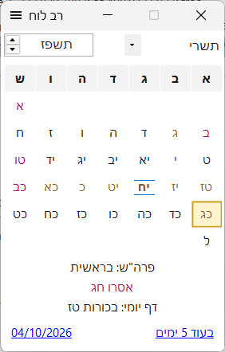

# רב לוח

לוח שנה עברי ולועזי למחשב - חגים, זמני היום, ימי הולדת ויאהרצייט, והדפסת לוחות שנה מעוצבים. **חינם.**

**[לאתר רב לוח](https://elischein.github.io/RavLuach/)** · **[הורדה](https://github.com/elischein/RavLuach/releases/latest/download/RavLuach-Setup.exe)** · [כל הגרסאות](https://github.com/elischein/RavLuach/releases)

### מה יש בו
- לוח עברי ולועזי, עם חגים ופרשת השבוע לארץ ישראל או לחוץ לארץ
- ימי הולדת, ימי נישואין ויאהרצייט - לפי תאריך עברי או לועזי, עם מספר השנים
- זמני היום, כולל הנץ והשקיעה הנראים על בסיס לוחות "חי"
- יצוא לוחות שנה להדפסה, עם טקסט, צבע ותמונה בימים
- יצוא הארועים ליומן - גוגל, אאוטלוק והטלפון
- דף יומי, ספירת העומר, קביעות השנה, מולדות ותקופות

### התקנה
מורידים את **RavLuach-Setup.exe** ומפעילים אותו. דרישות: Windows 10 או 11 (64 ביט) ו-.NET 8 Desktop Runtime - אם חסר, ההתקנה תציע קישור להורדתו.

> זמני היום מחושבים בקירוב - אין לסמוך עליהם בצמצום.

המאגר כולל את אתר התוכנה (בתיקייה `docs`) ואת קבצי ההתקנה (ב-Releases). לשאלות והערות: elischein@gmail.com

---

# RavLuach

A Hebrew/Gregorian calendar for Windows - Jewish holidays, halachic times, birthdays and yahrzeits, and printable calendars. **Free.** (Hebrew user interface.)

**[Website](https://elischein.github.io/RavLuach/)** · **[Download](https://github.com/elischein/RavLuach/releases/latest/download/RavLuach-Setup.exe)** · [All releases](https://github.com/elischein/RavLuach/releases)

### Features
- Hebrew and Gregorian calendar, with holidays and the weekly Torah portion for Israel or the diaspora
- Birthdays, anniversaries and yahrzeits - by Hebrew or Gregorian date, with the number of years
- Halachic times (zmanim), including visible sunrise and sunset based on the ChaiTables ("Luchos Chai")
- Printable calendars, with text, color and pictures on any day
- Export of your events to Google Calendar, Outlook and your phone
- Daf Yomi, Sefiras HaOmer, year structure, Molados and Tekufos

### Install
Download **RavLuach-Setup.exe** and run it. Requires Windows 10 or 11 (64-bit) and the .NET 8 Desktop Runtime - if it is missing, the installer offers a link to download it.

> Halachic times are approximate - do not rely on them to the minute.

This repository holds the program's website (in `docs`) and its installers (in Releases). Questions and feedback: elischein@gmail.com
